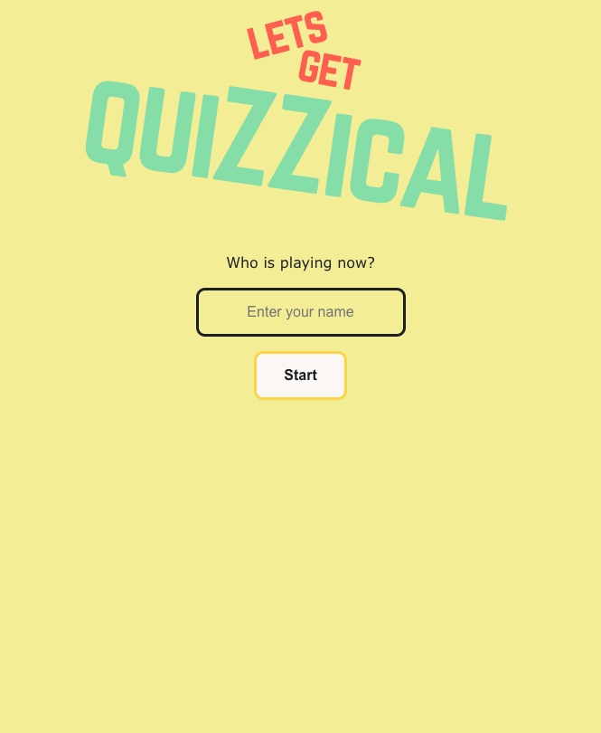
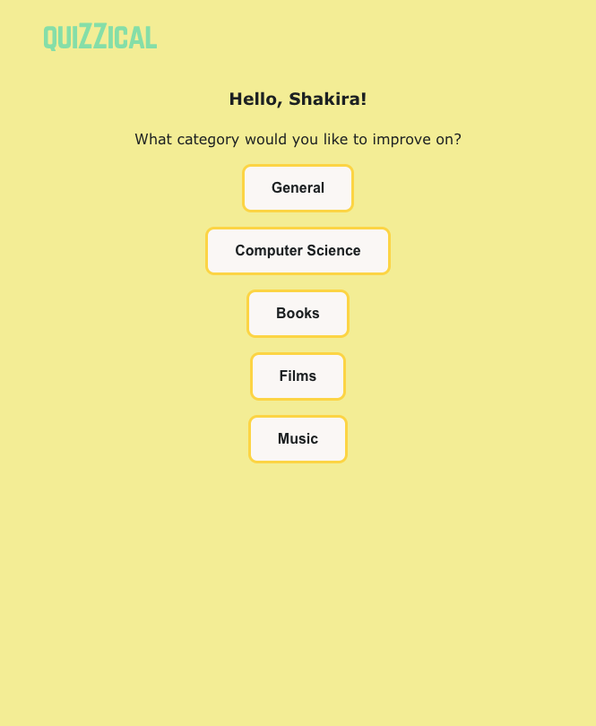
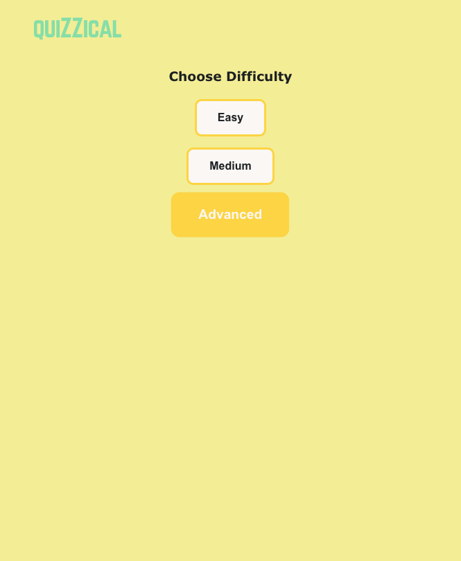
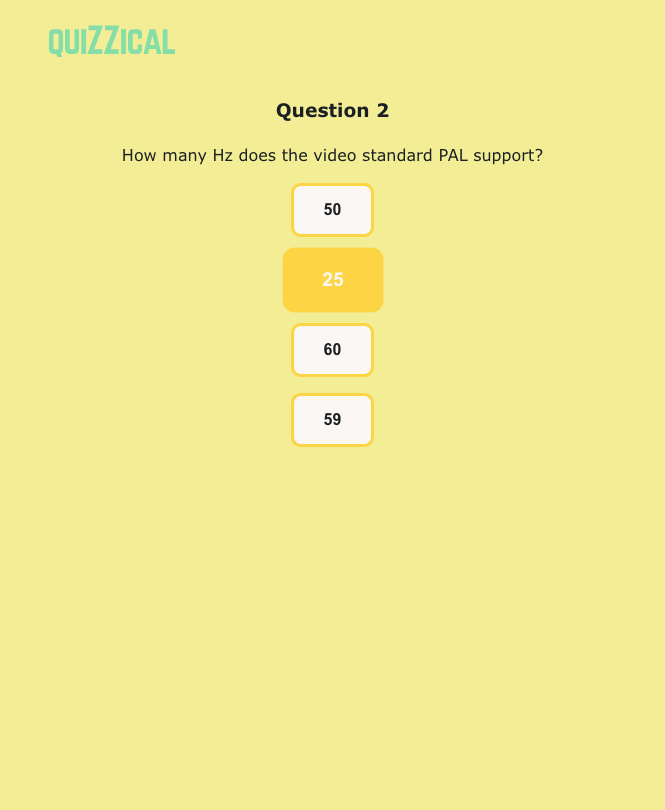
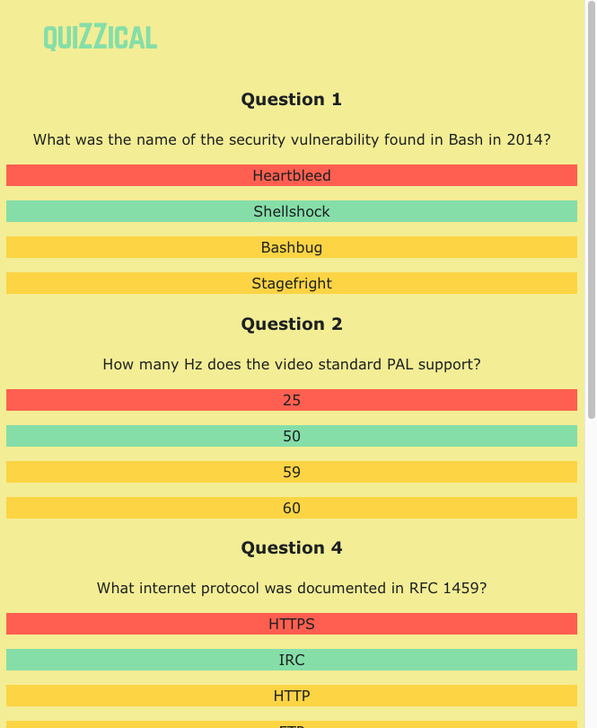
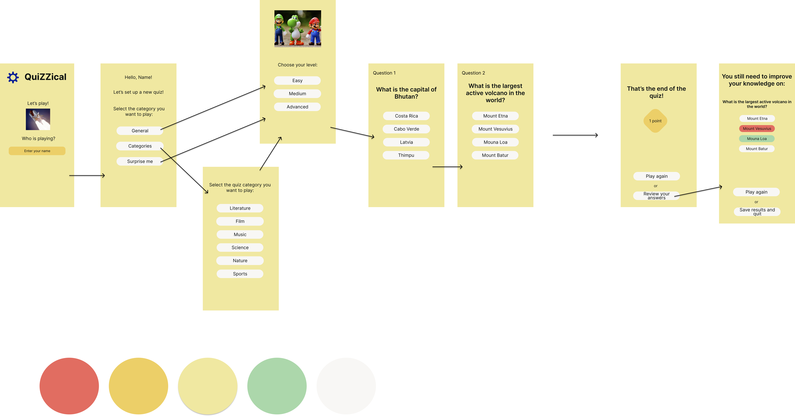
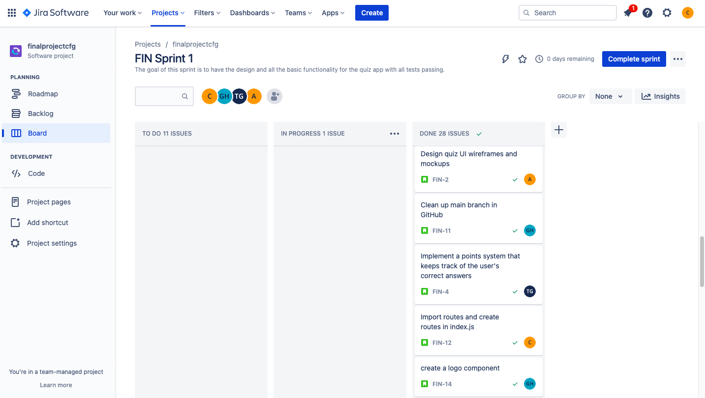

# Quiz_app
Quiz game which is designed to be an engaging and entertaining way to test and expand your knowledge on a variety of topics.

Whether you're a student looking for a new way to study, or simply someone who enjoys challenging your mind with trivia, this game is for you.

With a user-friendly interface and a wide range of questions covering topics from history to science, sports to pop culture, you'll never run out of opportunities to learn and have fun. 

Our team has put in countless hours to ensure that this game is not only entertaining, but also educational. So, why not give it a try?

*Start Page: Here's where you type your name and start playing:*

*On the next page, you can pick the category you want to test your knowledge in.*

*And then you can pick the difficulty:*

*The quiz is set. You can now start answering the questions:*

*At the end, you'll be able to view the total number of points you scored for the round.*

*You have the option to play again.*

*Simply click a button to access a review of the questions you answered incorrectly.*

*The incorrect answers are highlighted in red, while the correct answers are highlighted in green.*

*We used an external API to get the questions and answers: [OpenTriviaDB](https://opentdb.com/api_config.php)*

*Then we wireframed our app in Figma:*

*We then set up a board in Jira, where we added the tasks we needed to work on in order to complete the project:*

*The last step is to publish it and we chose to use Netlify to host our app:*

[QuizApp](todo: add link to our live app)

To run this app in your machine, after cloning this repo, you need to install the node modules locally. Navigate to the root folder of the project and in the terminal type:

`npm install`

Then you can start the app in the localhost by typing:

`npm start`

Have fun!